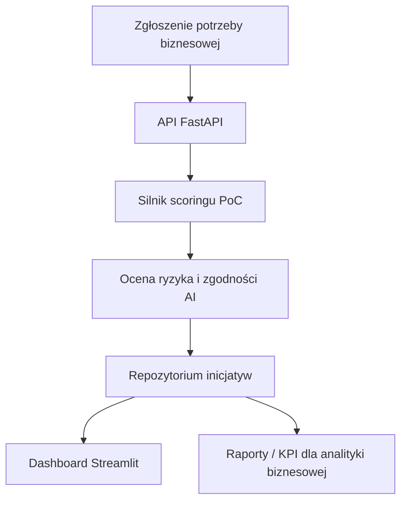

# Architektura rozwiązania

## Warstwy
- **Presentation**: dashboard Streamlit + Swagger UI
- **Application**: FastAPI endpoints
- **Domain**: modele danych i silnik rekomendacyjny
- **Analytics**: KPI i priorytetyzacja portfela PoC

## Rozszerzenia produkcyjne
- PostgreSQL zamiast pamięci lokalnej,
- Keycloak / Azure AD do uwierzytelniania,
- audyt zmian,
- integracja z lokalnym LLM,
- ocena zgodności z regulacjami.
